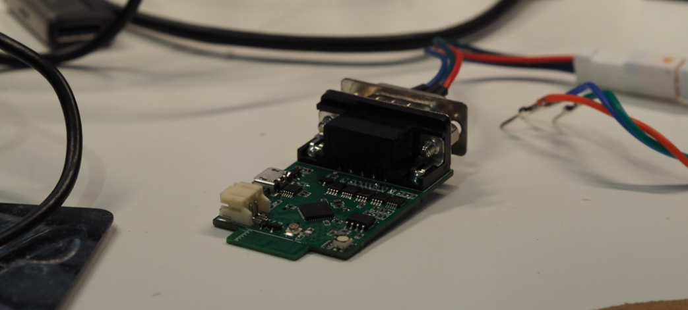
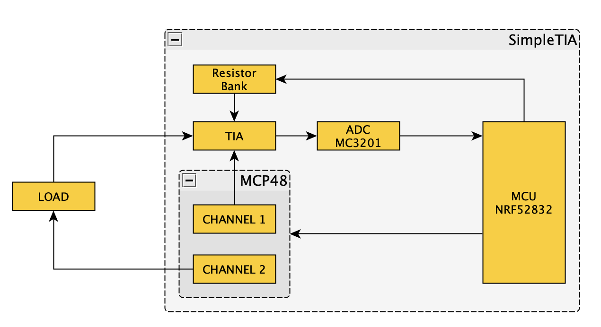
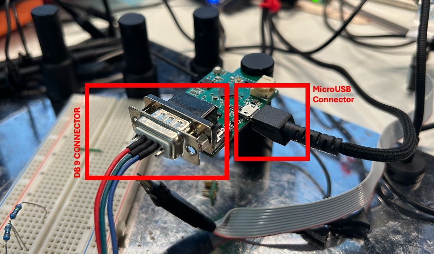
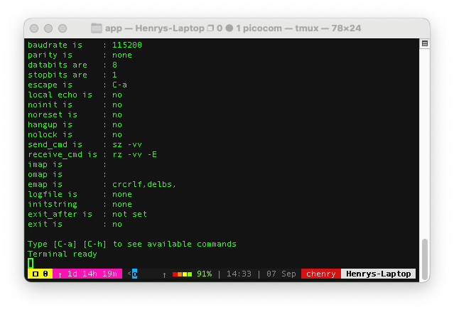
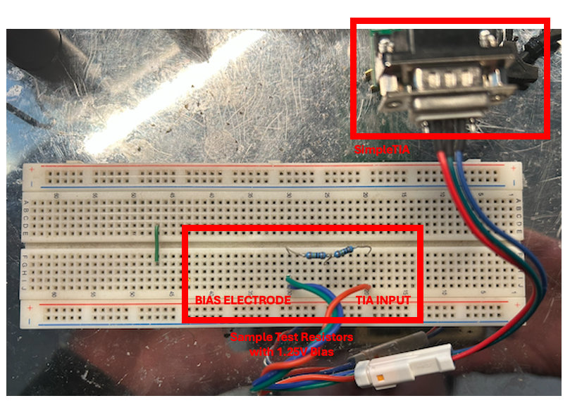

# Simple TIA

This circuit contains a TIA with multiple gain settings. It also contains a two channel DAC and a single ADC.



### Features

- Singled Ended Transimpedance Amplifier (TIA) with multiple gain settings
- Configurable TIA Gain for current measurements from 1mA to 100pA
- Configurable Load Bias up to +/- 1.65V
- UART Shell Interface for configuring the DAC, Reading from the ADC and Configuring the TIA Gain.

### Components



- Microcontroller: NRF52832
- DAC: MCP48FV12
- ADC: MCP3201
- Serial Port: CH340 USB to UART Bridge

## Getting Started

To setup the device, plug it into your computer via a micro-usb to usb cable. And connect in the Electrode Lead Plug (DB-9) to the board.



Use a serial terminal program (like PuTTY, Tera Term, or picocom) to connect to the device. The device will enumerate as a COM port on Windows or a /dev/ttyUSB* device on Linux. The serial port operates at 115200 baud. You should be greeted with an empty terminal.



Once connected, you can type `help` to see a list of available commands.

```
uart:~$ help

Available commands:
  adc      : ADC commands
  amux     : Analog multiplexer commands
  app      : Application version information commands
  clear    : Clear screen.
  dac      : DAC commands
  date     : Date commands
  device   : Device commands
  devmem   : Read/write physical memory
             Usage:
             Read memory at address with optional width:
             devmem <address> [<width>]
             Write memory at address with mandatory width and value:
             devmem <address> <width> <value>
  help     : Prints the help message.
  history  : Command history.
  kernel   : Kernel commands
  rem      : Ignore lines beginning with 'rem '
  resize   : Console gets terminal screen size or assumes default in case the
             readout fails. It must be executed after each terminal width change
             to ensure correct text display.
  retval   : Print return value of most recent command
  shell    : Useful, not Unix-like shell commands.

uart:~$ 
```

Before making measurements ensure the DAC channels are set to the desired voltages and the TIA gain is set appropriately for your measurement. Refer to [Serial Commands](#serial-commands) for a list of available commands to configure the device.

> [!WARNING]
> By default, devie is configured at startup as follows: 
> - DAC Channel 0: 0V
> - DAC Channel 1: 1.25V
> - TIA Gain: 1 KOhm

> [!IMPORTANT]
>It should be noted that the voltage accross the electrodes is determined by the difference between the two DAC channels.
> DAC Channel 1 is the voltage applied to the non-inverting input of the TIA. This is what enables the TIA to measure both, positve and negative going currents.
>
> DAC Channel 0 is the voltage applied to bias the the load. This can be configured to be higher or lower than the voltage on DAC Channel 1 - enabling both, negative and positive bias.
> 
> The voltage accross the electrodes is given by: `V_electrodes = V_DAC1 - V_DAC0`
> For example, if DAC Channel 1 is set to 1.25V and DAC Channel 0 is set to 0V, the voltage accross the electrodes is +1.25
>
> It is important to know that the maximum output of each DAC channel is 3.3V.

Once configured, connect the DB-9 electrode lead plug to device under test. The pinout of the DB-9 connector is as follows:

| Wire Color |  Description               |
| - | - |
| Red        | TIA Input |
| Blue      | Bias Voltage Output |
| Green      | Bias Voltage Output (Shorted to Blue) |

Connect the red wire to the electrode where current is expected to flow into the TIA (anode). Connect the blue/green wire to the electrode where current is expected to flow out of the TIA (cathode). The blue and green wires are shorted together on the DB-9 connector, so either can be used.



When configured, the device can now be used to make current measurements. The ADC can be read using the `adc read` command. The output of this command is the converted current measurement appropriate units based on the configured TIA gain (uA, nA and pA).

```
uart:~$ amux mode 1
Analog multiplexer set to mode 1: A0=0, A1=1, resistor: 100k

uart:~$ dac write 0 0
DAC Channel 0 set to 0.000 V (10-bit code: 0)
Current DAC configuration: Channel 0: 0.000 V, Channel 1: 1.250 V

uart:~$ dac write 1 1.25
DAC Channel 1 set to 1.250 V (10-bit code: 387)
Current DAC configuration: Channel 0: 0.000 V, Channel 1: 1.250 V

uart:~$ adc read
Current: -2308.199 nA
[00:29:03.344,726] <inf> main: ADC Code: 0x1427
[00:29:03.344,757] <inf> main: ADC Voltage: 1.587 V

// Reduce Impedance from 2M to 1M

uart:~$ adc read
Current: -2853.904 nA
[00:30:53.839,843] <inf> main: ADC Code: 0x152A
[00:30:53.839,874] <inf> main: ADC Voltage: 1.667 V

// NOTE: The 500nA increase in current due to the 
//       decrease in impedance. 
//       This is within the expected difference 
//       between the measurements.

uart:~$ 
```

> [!WARNING]
> This unit is not precision-calibrated. Expect gain error (±30%) and offset errors, increasing at higher gains and in sub-nA/pA ranges. Use for relative trends rather than absolute measurements.

> [!NOTE]
> `TODO`
>
> - [ ] Improve Device Calibration
> - [ ] Add user configurable gain settings in the Shell Interface
> - [ ] Use NVR to store user settings across power cycles

## Serial Commands

### DAC Commands

- `dac write <channel> <value>`: Set the DAC output for the specified channel (0 or 1) to the given value (0-3.3V). 

- `dac read`: Read the configured DAC voltages for both channels.

### ADC Commands

- `adc read`: Read the current value from the ADC.

### TIA Gain Commands

- `amux mode <mode>`: Set the TIA gain mode. Available modes are:
  - `0` for a 10 MOhm gain
  - `1` for a 100 KOhm gain
  - `2` for a 1 KOhm gain